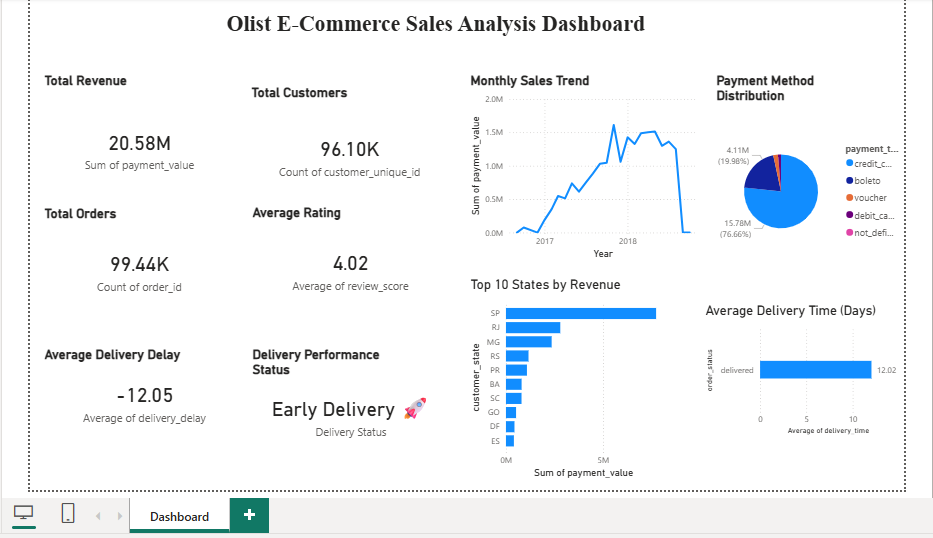
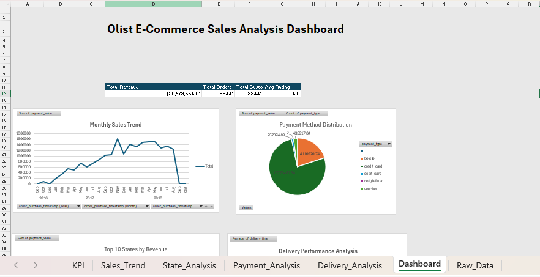
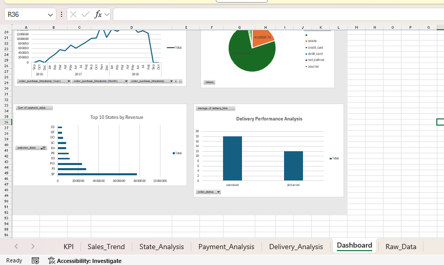

# Brazilian E-Commerce Sales Analysis

## About the Project
This project is based on the Brazilian E-Commerce dataset provided by Olist on Kaggle. The main goal of the project was to perform end-to-end data analysis using SQL, Python, Excel, and Power BI to understand sales performance, customer behavior, payment trends, and delivery operations.

The project started with multiple raw datasets and followed a complete analytics workflow including data cleaning, merging, analysis, visualization, and dashboard creation.

---

## Tools Used
- SQL
- Python
- Pandas
- NumPy
- Matplotlib
- Excel
- Power BI

---

## Dataset Source
Brazilian E-Commerce Public Dataset by Olist:

https://www.kaggle.com/datasets/olistbr/brazilian-ecommerce

The project uses multiple datasets such as:
- Customers
- Orders
- Payments
- Products
- Reviews
- Sellers

A final merged dataset was created using Python for analysis and dashboarding.

Note: Raw datasets and merged dataset files are not included in this repository because of file size limitations.

---

## Project Workflow

### SQL Analysis
Used SQL to perform:
- Joins
- Aggregations
- Revenue analysis
- Order analysis
- Customer analysis
- Payment analysis

### Python Analysis
Used Python for:
- Data cleaning
- Handling missing values
- Dataset merging
- Exploratory Data Analysis (EDA)
- Feature engineering

### Excel Analysis
Performed analysis in Excel using:
- Pivot Tables
- Pivot Charts
- KPI calculations
- Sales trend analysis

Excel dashboard screenshots are included in the repository.

### Power BI Dashboard
Created an interactive dashboard to analyze:
- Total Revenue
- Total Orders
- Total Customers
- Average Review Rating
- Monthly Sales Trend
- Payment Method Distribution
- Delivery Performance
- Top States by Revenue

---

## Key Insights
- Revenue showed strong growth during 2017 and early 2018.
- Credit cards were the most commonly used payment method.
- Some states generated significantly higher revenue compared to others.
- Customer ratings were generally positive with an average rating around 4.
- Most delivered orders arrived earlier than the estimated delivery date.

---
## Dashboard Preview

### Power BI Dashboard


---

### Excel Dashboard 1


---

### Excel Dashboard 2



## Project Structure

```text
Olist-Ecommerce-Analysis
│
├── sql
├── python
├── powerbi
├── screenshots
└── README.md
```

---

## What I Learned
This project helped me improve my practical skills in:
- SQL querying
- Data cleaning using Python
- Data visualization
- Dashboard creation
- Business insight generation

It also helped me understand the complete workflow of a real-world data analytics project.

---

## Author
Dipali Patil
