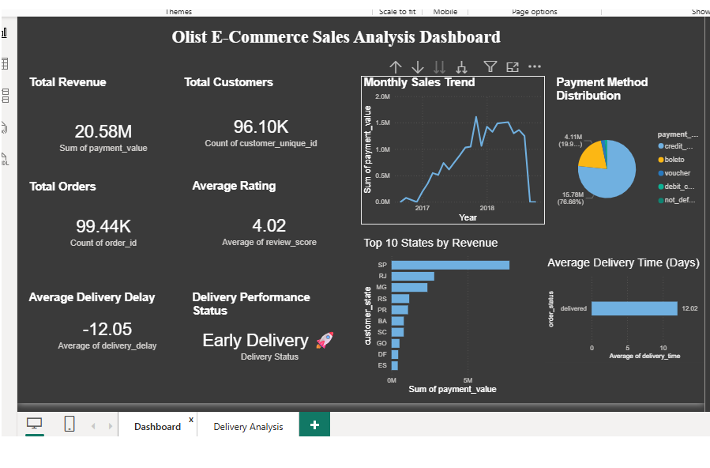
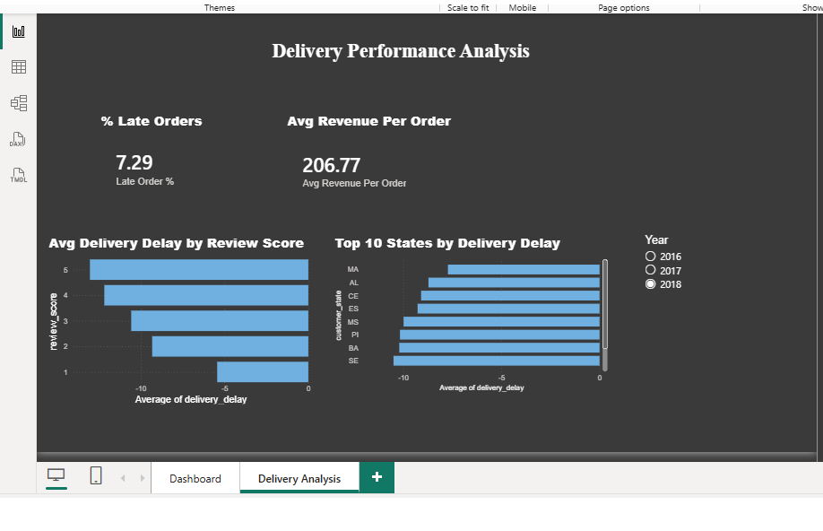
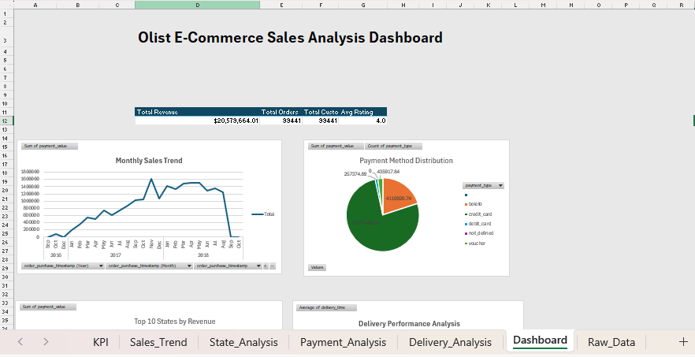
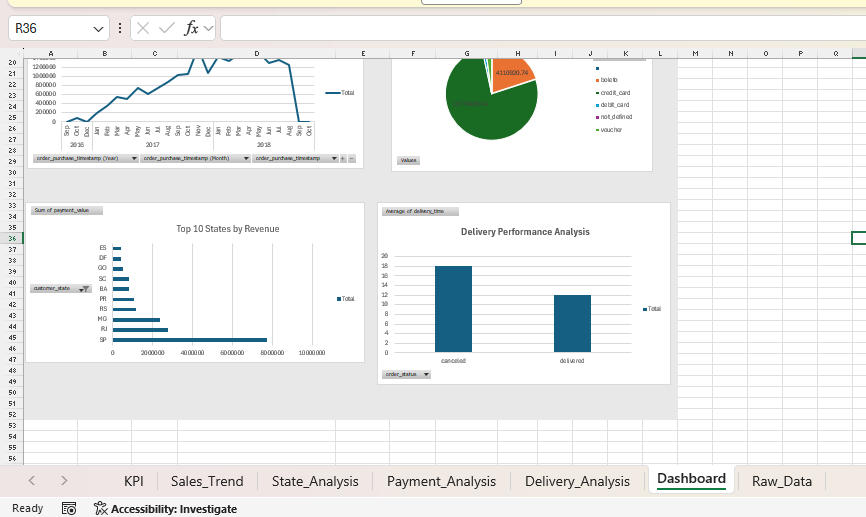

# Brazilian E-Commerce Sales Analysis (Olist Dataset)

## Business Questions Answered
1. What is the typical delivery experience for customers?
2. Do late deliveries directly hurt customer ratings?
3. Which product categories drive the most revenue?
4. Which states generate highest revenue and order volume?
5. Who are the top performing sellers?

## Tools Used
| Tool | Purpose |
|------|---------|
| SQL | Data querying, joins, aggregations  |
| Python | EDA, visualization, statistical analysis |
| Excel | Pivot tables, KPI tracking, trend analysis |
| Power BI | Interactive dashboard, DAX measures |

## Dataset
[Brazilian E-Commerce Public Dataset by Olist](https://www.kaggle.com/datasets/olistbr/brazilian-ecommerce)

## Key Findings
- **Delivery drives satisfaction** — 1-star reviews have highest average delivery delay; 5-star reviews are delivered early
- **93.7% orders delivered on time or early** — average delivery is 12 days before estimated date
- **São Paulo dominates** — SP accounts for majority of both revenue and order volume
- **Health & Beauty leads revenue** — top category with consistent growth potential
- **Credit card is primary payment method** — accounts for 76.66% of total revenue

## Dashboard Preview

### Power BI — Sales Overview

### Power BI — Delivery Performance Analysis

### Excel Dashboard

## Project Structure

## What I Learned
- Writing business-driven SQL queries across multiple joined tables
- Performing deep EDA in Python using Seaborn and Matplotlib
- Building DAX measures in Power BI (Late Order %, Avg Revenue Per Order)
- Translating data findings into actionable business insights

## Author
**Dipali Patil**  
MSc Computer Science  
[LinkedIn](https://linkedin.com/in/dipali-patil-) | [GitHub](https://github.com/Dpatil1604)
